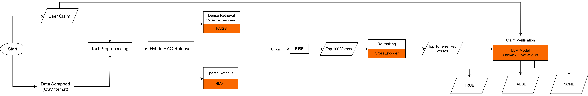
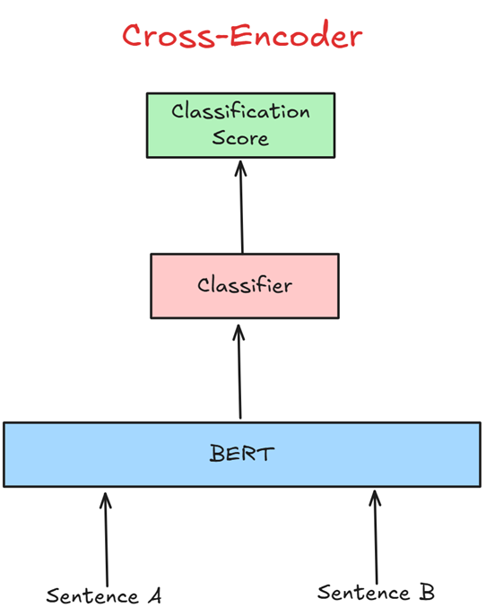
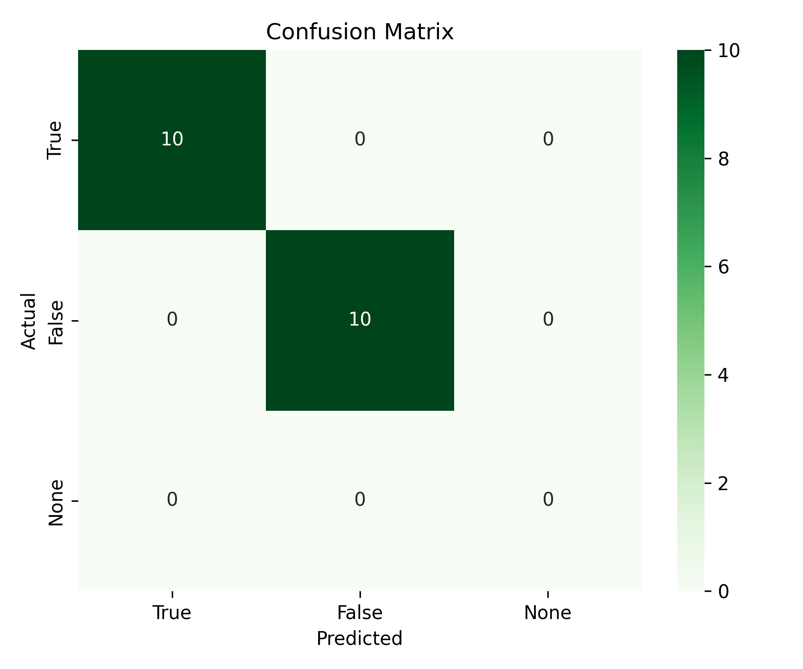
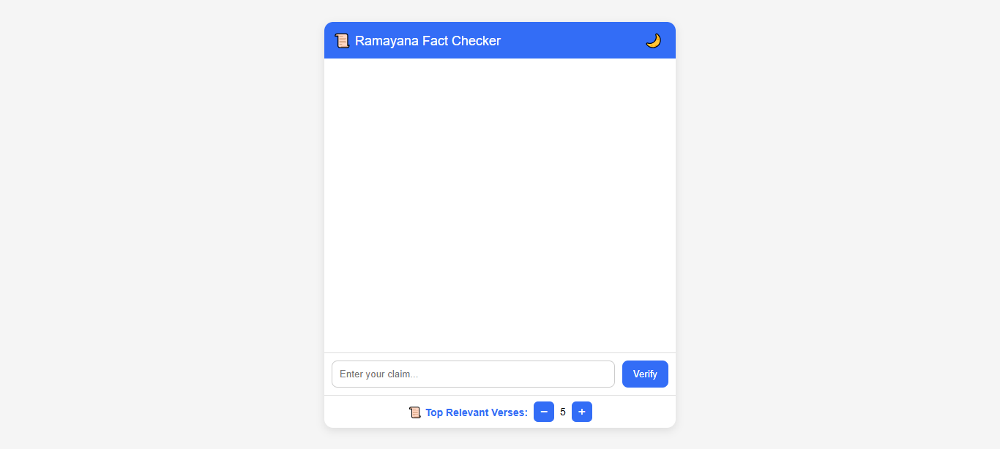
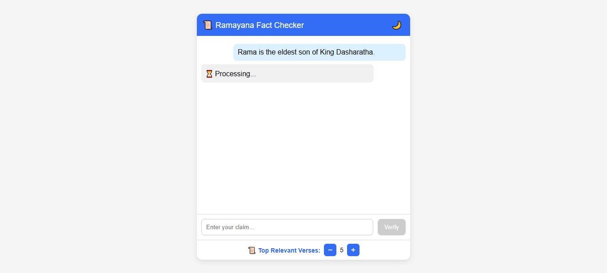
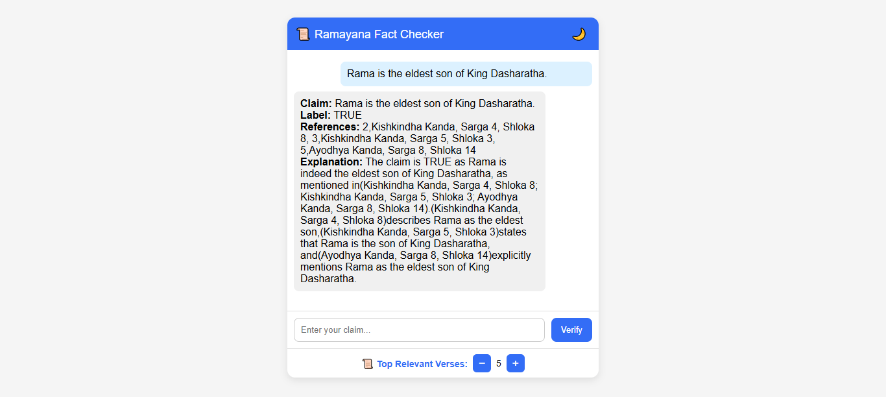

# Truth Retrieval: Context-Aware Fact-Checking with Language Models

An open-source, end-to-end system for verifying factual claims related to the **Valmiki Ramayana**, leveraging hybrid retrieval, re-ranking, and local LLM-based reasoning.

### ⚙️ Local inference powered by `llama.cpp`
---

## 🏆 Prize Winner — IYD Hackathon 2025

This project was awarded as a **Prize Winner at the IYD Hackathon 2025**, recognizing its innovation in cultural knowledge retrieval and verification.

🔗 Learn more about the hackathon here: [IYD Hackathon 2025 Website](https://www.yogavivek.org/hackathons/iyd-2025)


## 📘 Table of Contents

- [Motivation](#motivation)  
- [Pipeline Overview](#pipeline-overview)  
- [Dataset Construction](#dataset-construction)  
- [Hybrid Retrieval](#hybrid-retrieval)  
- [Cross-Encoder Re-Ranking](#cross-encoder-re-ranking)  
- [Claim Verification with Llama-3](#claim-verification-with-llama-3)  
- [Evaluation](#evaluation)  
- [Demo Web Interface](#demo-web-interface)  
- [How to Use](#how-to-use)  
- [Future Improvements](#future-improvements)  
- [References](#references)  
- [Author](#author)

---

# Motivation

Verifying facts in ancient texts requires contextual understanding, not just keyword matching.  
We frame the task as:

> **Given a user claim and verses from the Valmiki Ramayana, determine whether the claim is True, False, or None.**

The decisions are evidence-grounded, transparent, and reproducible.

---

# Pipeline Overview

Below is the pipeline architecture:



---

# Dataset Construction

Scraped from **valmikiramayan.net**, stored as structured CSV ([valmiki-ramayana-verses.csv](data/valmiki-ramayana-verses.csv)) with:

- Book / Kanda  
- Chapter / Sarga  
- Verse Number  
- Verse Text (English)

### Preprocessing Steps

- lowercasing  
- trimming whitespace  
- punctuation normalization  
- spelling variant mapping  
  - e.g., *sita ↔ seetha*, *lakshmana ↔ lakshman*

---

# Hybrid Retrieval

We combine **semantic** and **lexical** retrieval for high recall & precision.

## 1. Dense Retrieval (FAISS)

- Embeddings: `intfloat/e5-large-v2`  
- Similarity: cosine similarity  
- Index: **FAISS FlatIP**

> 📌 **Insert Dense Retrieval Diagram Here**

---

## 2. Sparse Retrieval (BM25)

- Model: `rank-bm25`  
- Keyword-based lexical matching.

---

## 3. Reciprocal Rank Fusion (RRF)

Combines dense + sparse rankings using:

$$ {RRF}(d) = \sum_{i=1}^{n} \frac{1}{k + \text{rank}_i(d)} $$
$k = 60$ (tunable hyper-parameter)


# Cross-Encoder Re-Ranking

Model: `cross-encoder/ms-marco-MiniLM-L6-v2`

- Input: `<claim, verse>` pairs  
- Output: relevance score  
- Retains top **10** most relevant verses



---

# Claim Verification with Llama-3

We use:

### 🦙 Meta-Llama-3-8B-Instruct.Q4_K_M (quantized)  
### ⚙️ Running locally via **llama.cpp**

### Instruction Format

We provide:

- the claim  
- top 10 retrieved verses  
- instruction to output structured JSON  

### Example Output
```json
{
  "claim": "",
  "verdict": "True | False | None",
  "reference": [],
  "explanation": ""
}
```

---

# Evaluation

Tested on 20 manually labeled claims. -> [test_claims.csv](data/test_claims.csv)

Includes:
- precision
- recall
- F1 score
- confusion matrix



### Classification Report:
| Metric | Value |
|--------|-------------|
| Accuracy | 1.0 |
| Precision | 1.0 |
| Recall | 1.0|
| F1 Score | 1.0 |

---

# 🚀 Running the Application

Follow the steps below to set up and run the Valmiki Ramayana Fact-Checking web application locally.

---

## 1️⃣ Create a Virtual Environment (Recommended)

```bash
python -m venv venv
source venv/bin/activate         # Linux / macOS
venv\Scripts\activate            # Windows
```
## 2️⃣ Install All Dependencies

Make sure requirements.txt is in your project directory.

```bash
pip install -r requirements.txt
```

### 📝 Installation of llama-cpp-python

Please follow the official installation manual for your system:

👉 Official llama-cpp-python Installation Guide
GitHub: https://github.com/abetlen/llama-cpp-python

## 3️⃣ Start the Backend Server

Run the FastAPI (or Flask) backend:

```bash
python -m uvicorn app:app --reload
```

This will start your local API server, e.g.:

```http://127.0.0.1:8000```

## 4️⃣ Open the Frontend in a Browser

Navigate to the frontend directory:

```bash
cd frontend
```

Now open the `index.html` file in any modern web browser:
- Double-click `index.html`, or
- Open it manually in Chrome/Firefox, or
- Use:
    - `start index.html`       # Windows
    - `open index.html`        # macOS
    - `xdg-open index.html`    # Linux

The web interface will load and connect to the running backend.

---

# Demo Web Interface

A simple UI for entering claims and viewing results.

<p align="center">
  
  
  
</p>

### Note: verses number will correspond to the verse text which will be added soon.

---

# References
- A Web Developers Guide to Hybrid Search. (2024, April 9). Retrieved from https://weaviate.io/blog/hybrid-search-for-web-developers
- Nearest Neighbor indexes for similarity search. (n.d.). Retrieved from https://www.pinecone.io/learn/series/faiss/vector-indexes/
- Wijaya, C. Y. (2025, January 24). RAG reranking to elevate retrieval results. Retrieved from https://www.nb-data.com/p/rag-reranking-to-elevate-retrieval

---

# 👤 Author  
[Pradyuman Thakur](https://www.linkedin.com/in/pradyuman-thakur-955238212/)

---

# 📜 License  
MIT License
